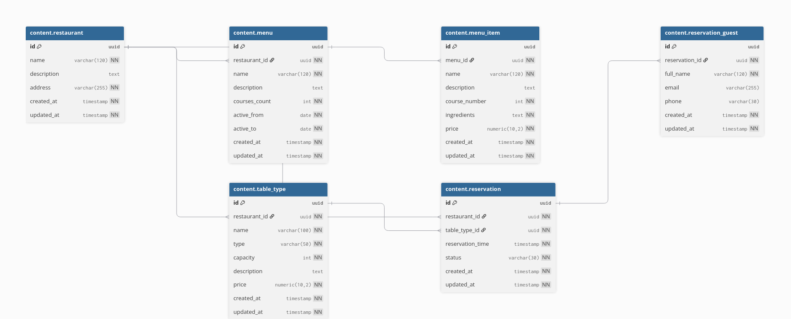

# Evaluacion-backend
## Escenario escogido: Restaurante
### Como correr / ejecutar el proyecto
1.- Renombrar el archivo `.env_template` a `.env`


2.- Rellenar las variables de entorno, si no las sabe, consultar al creador.


3.- Ejecutar el comando 
``` bash 
docker compose up -d --build 
```


4.- Rutas de interes

`http://localhost:80/admin` --> Administrador de django.


`http://localhost:80/` --> Frontend.


`http://localhost:80/api/v1/healthz` --> Chequear salud de la api.


5.- Desiciones Técnicas

```bash
├── db-desing
│   └── restaurant-db.sql
├── docker-compose.yml
├── nginx
│   └── nginx.conf
├── pyproject.toml
├── README.md
├── src
│   ├── admin
│   ├── app_api
│   └── ui

```

5.1.- El diseño de la base de datos se encuentra en la carpeta `db-desing`, esta tambien cuenta con un script de inicialización de registros, apróximadamente 300-500 registros.



La base de datos fue diseñada siguiendo una estructura basada en los requerimientos La entidad `restaurant` actúa como núcleo principal del modelo, ya que representa cada restaurante y se relaciona con múltiples tipos de mesa (`table_type`), menús (`menu`) y reservas (`reservation`). Esta separación permite mantener la información organizada por restaurantes, evitando redundancia de datos y facilitando futuras ampliaciones del sistema. Las entidades `menu` y `menu_item` fueron divididas para representar correctamente la relación entre un menú y los distintos platos o cursos que lo componen, permitiendo manejar menús degustación de varios tiempos de manera flexible.

Por otro lado, la entidad `reservation` centraliza la información de las reservas realizadas, relacionándose tanto con el restaurante como con el tipo de mesa seleccionado. A su vez, `reservation_guest` permite asociar múltiples invitados a una misma reserva, representando una relación uno a muchos necesaria para modelar reservas grupales. Además, las tablas incluyen restricciones, validaciones e índices para garantizar integridad de datos, consistencia y un mejor rendimiento en consultas frecuentes, especialmente en operaciones relacionadas con disponibilidad, horarios y gestión de reservas. 


Se le añadieron los indices para optimizar las peticiones de `disponibilidad`:
Por ejemplo, idx_reservation_time mejora el rendimiento de consultas relacionadas con fechas y horarios de reservas, mientras que idx_reservation_status acelera filtros por estado como reservas confirmadas, pendientes o canceladas. Estos índices permiten que PostgreSQL encuentre la información de manera más eficiente sin recorrer completamente las tablas.
También se crearon índices sobre claves foráneas como restaurant_id, menu_id y reservation_id, utilizados en relaciones uno a muchos entre entidades como restaurantes, menús, mesas y reservas. Esto optimiza operaciones comunes del sistema, como cargar los tipos de mesa de un restaurante, obtener los platos de un menú o listar los invitados de una reserva, mejorando considerablemente el rendimiento general de la aplicación.
